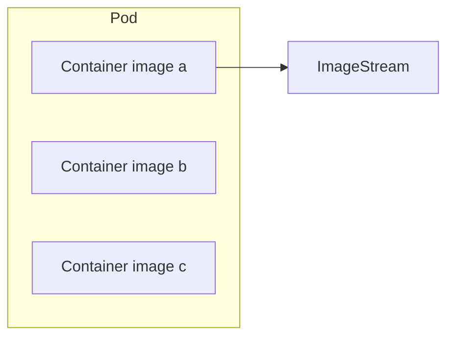
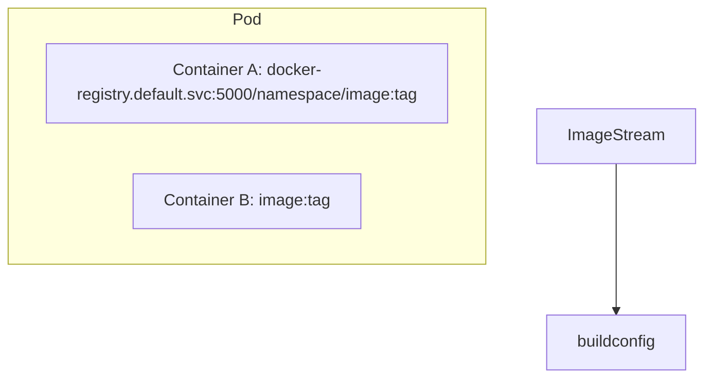
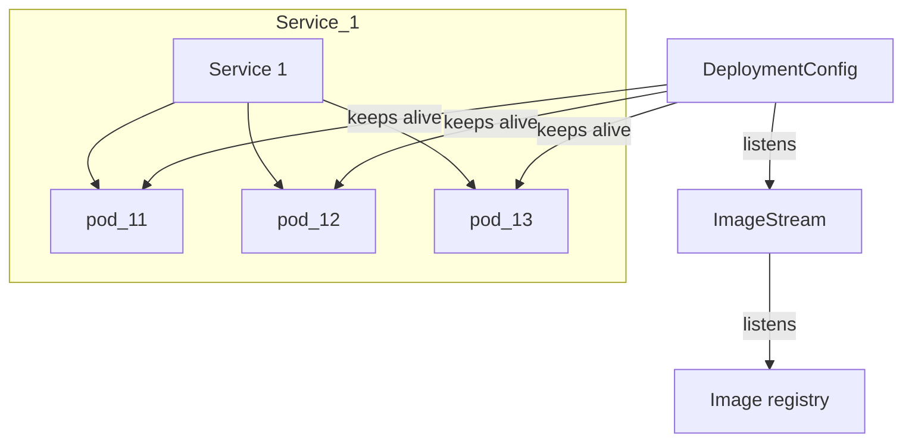

# Simplest possible app in openshift

Suppose that we have a openshift namespace `staticserve`. We want run image in the local docker registry `docker-registry.default.svc:5000/staticserve/serveimage:latest` and we'd like to expose its port 8080 at `ourservice-staticserve.rahtiapp.fi`.

In simplest possible case we need
1. Pod that runs the container
2. Service that exposes the pod internally and gives it a predicatble name to refer
3. Route that will expose the Service in 2. to outer world and redirects `outerservice-staticserve.rahtiapp.fi` to the given service object.

So lets go ahead and define the pod, service and the route manually.

**Handmade pod**

*`pod.yaml`:*

```yaml
apiVersion: v1
kind: Pod
metadata:
  name: pod
  labels:
    app: blogtest
    pool: servepod
spec:
  containers:
  - name: serve-cont
    image: "docker-registry.default.svc:5000/staticserve/serveimage:latest"
```

* `spec.containers[0].image` is the image name that runs inside the container 0 inside the pod. Typically this is populated by openshift deployments or statefulsets.
* `metadata.name` is the name so that the pod can be referred using, e.g., `oc`:
  ```bash
  oc get pods servepod
  ```
  Typically this is populated by openshift when pod is created automatically.
* `metadata.labels.pool` is just an arbitrary label so that the pod can be referred by, e.g., *services*.

**Handmade service**

*`service.yaml`:*
```yaml
apiVersion: v1 # REQUIRED
kind: Service # REQUIRED
metadata:
  name: serve # REQUIRED
  labels:
    app: blogtest
spec:
  ports:
  - name: 8080-tcp
    port: 8080
    protocol: TCP
  selector:
    pool: pod
```

* This will redirect TCP traffic internally to pods with label "pool=servepod".

**Handmade route**

*`route.yaml`:*
```yaml
apiVersion: v1
kind: Route
metadata:
  labels:
    app: blogtest
  name: servepod
spec:
  host: ourservice-staticserve.rahtiapp.fi
  to:
    kind: Service
    name: serve
    weight: 100
```

* Currently `spec.to.kind` must be `Service`.
* If the service `spec.to.name` has multiple ports defined then it might make sense to define `spec.port.targetport`

So now we have a pod, a service and a route. But what happens if image is updated?

## 2-minute introduction on yaml files

YAML (YAML Ain't Markup Language) format is a superset of JSON. It is used to describe key-value maps and arrays.

YAML dataset can be
* Value
* Array
* Key-Value pair

Value can be
* YAML dataset
* JSON atomic value
* Empty

Key can be for example:
* `key:`
* `key_with_underline:`
* `key with spaces:`
* `"key in quotes":`
* `key-in-lisp-case`

Although it might not be a good idea to include

Array can be formatted as
```yaml
- item 1
- item 2
- map 1: [map 1 item 1, map 1 item 2]
```

If the value of key-value pair is not an atomic value then it needs to be written on the next line
an indented relative to key indentation. For example:
```yaml
map_1:
  - "map 1 item 1"
  - "map 1 item 2"
  - "map 1 key 1":
      value
```

# Images





# Services

```yaml
apiVersion: v1
kind: Service
metadata:
  name: docker-registry
spec:
  selector:
    docker-registry: default # all pods with docker-registry=default label are behind this svc
  clusterIP: 173.30.136.123 # Virtual IP of service, allocated automatically
  ports:
  - nodePort: 0
    port: 5000
    protocol: TCP
    targetPort: 5000
  externalIPs:
  - 192.0.1.1
```

`externalIPs` must be configured in `/etc/origin/master/master-config.yaml` by cluster admins.

# Pods

Straight from okd documentation:

```yaml
apiVersion: v1
kind: Pod
metadata:
  annotations: { ... }
  labels:                                
    deployment: docker-registry-1
    deploymentconfig: docker-registry
    docker-registry: default
  generateName: docker-registry-1-       
spec:
  containers:                            
  - env:                                 
    - name: OPENSHIFT_CA_DATA
      value: ...
    - name: OPENSHIFT_CERT_DATA
      value: ...
    - name: OPENSHIFT_INSECURE
      value: "false"
    - name: OPENSHIFT_KEY_DATA
      value: ...
    - name: OPENSHIFT_MASTER
      value: https://master.example.com:8443
    image: openshift/origin-docker-registry:v0.6.2 # instantiated from this image
    imagePullPolicy: IfNotPresent
    name: registry
    ports: # container can bind these ports and they are made public at pod ip
    - containerPort: 5000
      protocol: TCP
    resources: {}
    securityContext: { ... } # This is weird!
    volumeMounts:                       
    - mountPath: /registry
      name: registry-storage
    - mountPath: /var/run/secrets/kubernetes.io/serviceaccount
      name: default-token-br6yz
      readOnly: true
  dnsPolicy: ClusterFirst
  imagePullSecrets:
  - name: default-dockercfg-at06w
  restartPolicy: Always                 
  serviceAccount: default               
  volumes:                              
  - emptyDir: {}
    name: registry-storage
  - name: default-token-br6yz
    secret:
      secretName: default-token-br6yz
```

Points:
* pods need to have unique name in the namespace
* multiple containers in the containers array
* can pass env variables to each of the containers
* admins can modify this.

## Init container

```yaml
apiVersion: v1
kind: Pod
metadata:
  name: myapp-pod
  labels:
    app: myapp
spec:
  containers:
  - name: myapp-container
    image: busybox
    command: ['sh', '-c', 'echo The app is running! && sleep 3600']
  initContainers:
  - name: init-myservice
    image: busybox
    command: ['sh', '-c', 'until nslookup myservice; do echo waiting for myservice; sleep 2; done;']
  - name: init-mydb
    image: busybox
    command: ['sh', '-c', 'until nslookup mydb; do echo waiting for mydb; sleep 2; done;']
```

* init containers are run in sequence before other containers are started
* used to, e.g., transfer initialization information through volume mounts

# Routes and services


# Builds

and `BuildConfig` object:

```yaml
kind: "BuildConfig"
apiVersion: "v1"
metadata:
  name: "ruby-sample-build"
spec:
  runPolicy: "Serial"
  triggers:
    -
      type: "GitHub"
      github:
        secret: "secret101"
    - type: "Generic"
      generic:
        secret: "secret101"
    -
      type: "ImageChange"
  source:
    git:
      uri: "https://github.com/openshift/ruby-hello-world"
  strategy:
    sourceStrategy:
      from:
        kind: "ImageStreamTag"
        name: "ruby-20-centos7:latest"
  output:
    to:
      kind: "ImageStreamTag"
      name: "origin-ruby-sample:latest"
  postCommit:
      script: "bundle exec rake test"
```

* Source can be inline Dockerfile:

```yaml
source:
  dockerfile: |
    FROM ...
    LABEL maintainer="..."
    RUN ...
  type: Dockerfile
```

# Other similar technologies

## Container clouds

* Docker swarm
* Kubernetes
* Mesos

## Container image formats

* Docker
* AppC
