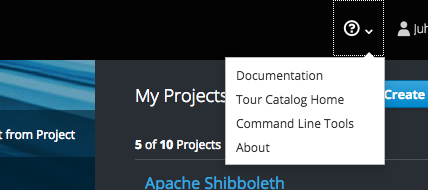
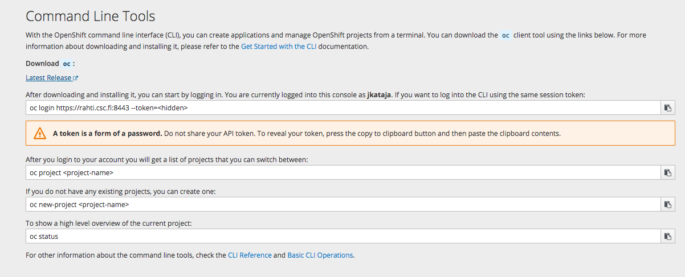
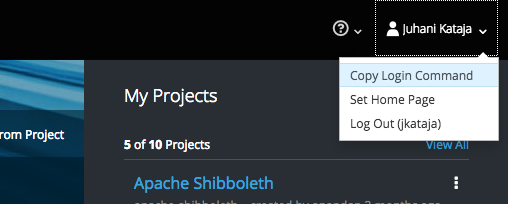

# Handmade app in openshift utilizing core concepts

Here we walk through the core concepts of Kubernetes in the form of static http server example. We create the application only using `oc` command line tool and by describing its parts in YAML.

In this example, a apache http server is started from image included in openshift by default and the server is exposed at myservice-my-project-with-unique-name-123.rahtiapp.fi.

In simplest possible case we need

1. Pod that runs the container
2. Service that exposes the pod internally and gives it a predictable name to refer
3. Route that will expose the Service in 2. to outer world and redirects
   `myservice-staticserve.rahtiapp.fi` to the given service object.

Beware that the approach here is not actually the way OpenShift applications *should* be deployed, but instead we walk through the core concepts of OpenShift in such a way that building applications in proper way becomes more approachable. If you already know about pods, services and routes, you might be interested in the chapter **HandMade app using OpenShift extensions**.

Having said that, lets go ahead and define the pod, service and the route manually.

## Preparations

If you are logged in to Rahti and have the OpenShift command line tool `oc` installed, you can skip this section now.

Otherwise, we assume that you have a Rahti account. Install the `oc` command line tool and authenticate a command line session by logging in to rahti at https://rahti.csc.fi:8443/ and following instructions

* Install `oc` command line tools by clicking the question mark -> "Command Line Tools" at up right corner of OKD console: 

  

  and click the Latest release link:

  

* Download and unpack correct version for your platform and make sure that the binaries are found in a directory that is in the PATH environment variable.

* Copy login command by clicking here:

  
  
  and paste the result to terminal, the result should be similar to:

  ```bash
  $  oc login https://rahti.csc.fi:8443 --token=<secret access token>
  ```

  The secret access token is valid only for limited time, so each time on starts working with `oc` tool, one needs to re-authenticate.

## Projects

To make sure that one is in a suitable project in OKD there is the command `oc projects`:

```bash
$ oc projects
You have access to the following projects and can switch between them with 'oc project <projectname>':

    someone-elses-public-project
  * my-project-with-unique-name-123

Using project "my-project-with-unique-name-123" on server "https://rahti.csc.fi:8443".
```

If there would've not been any suitable project to work in, a new one could've been created with

```bash
$ oc new-project my-project-with-unique-name-123
``` 

The name of the project needs to be unique across rahti container cloud. If you have multiple CSC projects, the description of the project must contain "csc_project: #######", where ####### is the project that should be billed. The description can be included in the `new-project` command as follows

```bash
$ oc new-project my-project-with-unique-name-123 --description='csc_project: #######'
```

## Handmade pod

Pods are objects that keep given number of containers running. If a container dies for some reason, pod will automatically try to run it again. One needs keep in mind that usually pods are not created by hand except in few special cases. Instead, higher level objects (Deployments, DeploymentConfigs, etc...) are typically utilized.

In our case, the pod will run the container image with the web server.

*`pod.yaml`*

```yaml
apiVersion: v1
kind: Pod
metadata:
  name: mypod
  labels:
    app: serveapp
    pool: servepod
spec:
  containers:
  - name: serve-cont
    image: "docker-registry.default.svc:5000/openshift/httpd"
```

Thus, this pod will run container image given in the field `spec.containers[0].image`. 

* `metadata.name` is the name so that the pod can be referred using, e.g., `oc`:

    ```bash
    oc get pods mypod
    ```

* `metadata.labels.pool` is just an arbitrary label so that the pod can be referred by, e.g., *services*.

Pods and other Kubernetes/OpenShift API objects are created with the `oc` command line utility as follows:

```bash
$ oc create -f pod.yaml
```

And they are deleted using the `oc delete` command:

```bash
$ oc delete pod mypod
```

Typically one allocates *resources* to containers, but in these examples we refrain from doing that for the sake of brevity. The same pod as above with memory and cpu resources of 200MB...1GB and 0.2CPU...1CPU would read as:

*`pod.yaml`*

```yaml
apiVersion: v1
kind: Pod
metadata:
  name: mypod
  labels:
    app: serveapp
    pool: servepod
spec:
  containers:
  - name: serve-cont
    image: "docker-registry.default.svc:5000/openshift/httpd"
    resources:
      requests:
        memory: "200M"
        cpu: "200m"
      limits:
        memory: "1G"
        cpu: "1"
```

## Handmade service

Notice that nowhere in the definition of pod there were mentions of its network identity such as IP address or hostname. That is because in Kubernetes, internal communication to pods are set up using *Service* objects:

*`service.yaml`*
```yaml
apiVersion: v1
kind: Service
metadata:
  name: serve
  labels:
    app: serveapp
spec:
  ports:
  - name: 8080-tcp
    port: 8080
    protocol: TCP
  selector:
    pool: servepod
```

This service will redirect TCP traffic internally in the project to the pods having labels listed in `spec.selector`. In this case, the service will redirect to all the pods having label `pool: servepod`. If there are multiple pods matching `spec.selector` then traffic is split between pods in a defined way.

## Handmade route

*`route.yaml`*
```yaml
apiVersion: v1
kind: Route
metadata:
  labels:
    app: serveapp
  name: myservice
  annotations:
    haproxy.router.openshift.io/ip_whitelist: 192.168.1.0/24 10.0.0.1
spec:
  host: myservice-my-project-with-unique-name-123.rahtiapp.fi
  to:
    kind: Service
    name: serve
    weight: 100
```

This route will redirect traffic from internet to that service in the cluster whose `metadata.name` equals `spec.to.name`. 

This particular route also allows traffic only from subnet `192.168.1.0/24` and the IP `10.0.0.1`. Security-wise it is highly encouraged to utilize ip-whitelisting. 

**CAUTION**: If the whitelist entry is malformed, OpenShift will discard the whitelist and traffic is allowed from everywhere.

* If the service `spec.to.name` has multiple ports defined then one should define `spec.port.targetport`
* By default the hostname is `metadata.name` + `-` + project name + `.rahtiapp.fi` unless otherwise specified in `spec.host`.

So now we have a pod, a service and a route. But what happens if the physical server where the pod happens to live is shut down or, even worse, crashes? ReplicationController object is the tool to remedy just that.

Or you can use ReplicaSet which is an advanced version of ReplicationController. It just support more refined pod selector semantics.

## Handmade ReplicationController

A ReplicationController ensures that there are `spec.replicas` number of pods running whose labels match `spec.selector.matchLabels` (or `spec.selector.matchExpression`). If there are too many, ReplicationController controller will shut down the extra and if there are too few, it will start up pods according to `spec.template` field. Actually, the template field is exactly the pod described in `pod.yaml` except the fields `apiVersion` and `kind` are missing. 

*`ReplicationController.yaml`*

```yaml
apiVersion: v1
kind: ReplicationController
metadata:
  labels:
    app: serveapp
  name: blogtest-replicator
spec:
  replicas: 1
  selector:
    matchLabels:
      app: serveapp
      pool: servepod
  template:
    metadata:
      name: mypod
      labels:
        app: serveapp
        pool: servepod
    spec:
      containers:
      - name: serve-cont
        image: "docker-registry.default.svc:5000/openshift/httpd"
```

A central Kubernetes' concept coined *reconciliation loop* manifests in ReplicationController. Reconciliation loop is a mechanism that measures the *actual state* of the system, constructs *current state* based to the measurement of the system and performs such actions that the state of the system would equal to the *desired state*.

In such a terminology, ReplicationControllers are objects that describe *desired state* of the cluster. Another such an object is the service object encountered earlier. There is an another reconciliation loop that compares the endpoints of the service the actual pods that are *ready* and adjusts accordingly. As a result, the endpoints of the service always point to pods that are ready and only those pods whose labels contain all the fields in the selector of the service object. In fact, every incidence of `spec` in a YAML representations of Kubernetes objects, describes a specification for a reconciliation loop. The loops for pods just happen to be tied to the worker nodes of Kubernetes.

## Conclusion

Creating applications using pods is useful in terms of understanding the basic components of Kubernetes but it is not encouraged to utilize kubernetes based container clouds this way. Instead, one should at least define a ReplicationController that will keep alive requested amount of replicas of pods defined in the ReplicationController template.

However, using Service and Route objects in the fashion described above is a sufficient design in most cases.

# Handmade app using OpenShift extensions

In this example we'll explore creating the `serveapp` using OpenShifts extensions `DeploymentConfig`, `ImageStream` and `BuildConfig`. Roughly speaking, their role in the process is this:

* BuildConfig objects build container images based on source files
* ImageStream objects that emit signals when it sees that a new image is uploaded into it by, e.g., BuildConfig
* a DeploymentConfig objects create new ReplicationControllers based on the new images

## Handmade DeploymentConfig

DeploymentConfig is an object that create ReplicationControllers according to `spec.template`. However, the difference to the ReplicationController is that DeploymentConfig can start new ReplicationController based on state of `spec.triggers`. 

*`deploymentconfig.yaml`*
```yaml
apiVersion: v1
kind: DeploymentConfig
metadata:
  labels:
    app: serveapp
  name: blogdeployment
spec:  
  replicas: 1
  selector:
    app: serveapp
    deploymentconfig: blogdeployment
  strategy:
    activeDeadlineSeconds: 21600
    type: Rolling
  template:
    metadata:
      labels:
        app: serveapp
        deploymentconfig: blogdeployment
    spec:
      containers:
      - name: serve-cont
        image: "serveimagestream:latest"
  triggers:
  - type: ConfigChange 
  - imageChangeParams:
      automatic: true
      containerNames:
      - serve-cont
      from:
        name: serveimagestream:latest
    type: ImageChange
```

In this case, the DeploymentConfig object will listen to *ImageStream* object `serveimagestream:latest`.

## Handmade ImageStream

ImageStreams simplify image names and get triggered by a BuildConfig if new
images are being uploaded to the registry. In the case where a new image is
uploaded, it can trigger its listeners to act. In the case of our
DeploymentConfig, action would be to do a rolling update for the pods that it is
meant to deploy.

A simple ImageStream object looks like this:

*`imagestream.yaml`*
```yaml
apiVersion: image.openshift.io/v1
kind: ImageStream
metadata:
  labels:
    app: serveapp
  name: serveimagestream
spec:
  lookupPolicy:
    local: false
```

## Handmade BuildConfig

A BuildConfig objects create container images according to specific rules. In the following example the Docker strategy is used to build trivial extension of `httpd` image shipped with openshift.

```yaml
kind: "BuildConfig"
apiVersion: "v1"
metadata:
  name: "serveimg-generate"
  labels:
    app: "serveapp"
spec:
  runPolicy: "Serial"
  output:
    to:
      kind: ImageStreamTag
      name: serveimagestream:latest
  source:
    dockerfile: |
      FROM docker-registry.default.svc:5000/openshift/httpd
  strategy: 
    type: Docker
```

After creating the build object (here named `serveimg-generate`), we can request openshift cluster to build the image by

```bash
$ oc start-build serveimg-generate
```

# Typical Kubernetes/OpenShift design patterns and objects

## Persistent storage

Persistent storage is requested from the cluster using `PersistentVolumeClaim` objects:

*`pvc.yaml`*
```yaml
apiVersion: v1
kind: PersistentVolumeClaim
metadata:
  name: testing-pvc
spec:
  accessModes:
  - ReadWriteMany
  resources:
    requests:
      storage: 1Gi
```

This will request a 1 GiB persistent storage that can be mounted in read-write mode by multiple nodes.

The persistent volume can be mounted to pods with `spec.volumes` and `spec.containers.volumes`:

```yaml
apiVersion: v1
kind: Pod
metadata:
  name: mypod-vol
  labels:
    app: serveapp-vol
    pool: servepod-vol
spec:
  containers:
  - name: serve-cont
    image: "docker-registry.default.svc:5000/openshift/httpd"
    volumeMounts: 
    - mountPath: /mountdata
      name: smalldisk-vol
  volumes:
  - name: smalldisk-vol
    persistentVolumeClaim:
      claimName: testing-pvc
```

## InitContainer

*InitContainer* is a container in a pod that is run to completion before the main containers are started. Data from init containers are most easily transfered to the main container using volume mounts

```yaml
apiVersion: v1
kind: Pod
metadata:
  name: mypod
  labels:
    app: serveapp
    pool: servepod
spec:
  volumes: 
  - name: sharevol
    emptyDir: {}
  initContainers:
  - name: perlhelper
    image: perl
    command:
    - sh
    - -c
    - >
      echo Hello from perl helper > /datavol/index.html
    volumeMounts:
    - mountPath: /datavol
      name: sharevol
  containers:
  - name: serve-cont
    image: docker-registry.default.svc:5000/openshift/httpd
    volumeMounts:
    - mountPath: /var/www/html
      name: sharevol
```

Here we run init container from image perl which echoes stuff to file `index.html` on the shared volume. 

The shared volume is defined in `spec.volumes` and "mounted" in `spec.initContainers.volumeMounts` and `spec.containers.volumeMounts`.

## Jobs

*Jobs* are in a sense run-to-completion Pods, except that they operate on the same level as ReplicationControllers, in a sense that they too define template for pod to be launched instead of directly describing the pod. The difference is, however, that *Jobs* are not restarted when they finish.

```yaml
apiVersion: batch/v1
kind: Job
metadata:
  name: pi
spec:
  template:
    spec:
      volumes:
      - name: smalldisk-vol
        emptyDir: {}
      containers:
      - name: pi
        image: perl
        command:
        - sh
        - -c
        - >
          echo helloing so much here! Lets hello from /mountdata/hello.txt too: &&
          echo hello to share volume too >> /mountdata/hello-main.txt &&
          cat /mountdata/hello.txt
        volumeMounts: 
        - mountPath: /mountdata
          name: smalldisk-vol
      restartPolicy: Never
      initContainers:
      - name: init-pi
        image: perl
        command: 
        - sh
        - -c
        - >
          echo this hello is from the initcontainer >> /mountdata/hello.txt
        volumeMounts: 
        - mountPath: /mountdata
          name: smalldisk-vol
  backoffLimit: 4
```

## Passing configuration data to containers: ConfigMap and Secrets

**ConfigMaps** are useful in collecting configuration-type data in Kuberentes' objects. Their contents are communicated to containers by environmental variables or by volume mounts.

*`configmap.yaml`*:

```yaml
kind: ConfigMap
apiVersion: v1
metadata:
  name: my-config-map
data: 
  data.prop.a: hello
  data.prop.b: bar
  data.prop.long: |-
    fo=bar
    baz=notbar
```

The following pod imports the value of `data.prop.a` to `DATA_PROP_A` environment variable and creates files `data.prop.a`, `data.prop.b` and `data.prop.long` inside `/etc/my-config`:

*`configmap-pod.yaml`*:

```yaml
kind: Pod
apiVersion: Pod
metadata:
  name: my-config-map-pod
spec:
  restartPolicy: Never
  volumes:
  - name: configmap-vol
    configMap:
      name: my-config-map
  containers:
  - name: confmap-cont
    image: perl
    command: 
    - /bin/sh
    - -c
    - |-
      cat /etc/my-config/data.prop.long &&
      echo "" &&
      echo DATA_PROP_A=$DATA_PROP_A
    env:
    - name: DATA_PROP_A
      valueFrom:
        configMapKeyRef:
          name: prop-a-config
          key: data.prop.a
          optional: true     # Run this pod even if data.prop.a is not defined in configmap
    volumeMounts:
    - name: configmap-vol
      mountPath: /etc/my-config
```

The output log of this pod should be

```
fo=bar
baz=notbar
DATA_PROP_A=hello
```

**Secrets** behave much like ConfigMaps, but once created, they are stored in
base64 encoded form and their contents are not displayed by default with `oc
describe` command. There is an example of a Secret in the Webhooks section.

## Webhooks

Rahti supports Generic, GitHub, GitLab and Bitbucket webhooks. They are particularly useful in triggering builds.
The syntax for BuildConfig is as follows:

```yaml
spec:
  triggers:
  - type: GitHub
    github:
      SecretReference:
        name: webhooksecret
```

Now the Secret `webhooksecret` should have

```yaml
apiVersion: v1
kind: Secret
data:
  WebHookSecretKey: dGhpc19pc19hX2JhZF90b2tlbgo=    # "this_is_a_bad_token" in base64
metadata:
  name: webhooksecret
  namespace: mynamespace     # set this to your project namespace
```

When the BuildConfig is configured to trigger from the webhook and the corresponding secret exists, the webhook URL can be found by using (assuming we added the webhook to `serveimg-generate`) `oc describe` command:

```
$ oc describe bc/serveimg-generate
Name:		serveimg-generate
.
.
.
Webhook GitHub:
	URL:	https://rahti.csc.fi:8443/apis/build.openshift.io/v1/.../<secret>/github
.
.
.
```

Finally, the GitHub WebHook payload url is the url above with `<secret>` replaced with base64 decoded string of the value of `data.WebHookSecretKey` above and the content type is `application/json`.

# Further reading

* Kubernetes 
    * [Documentation](https://kubernetes.io/docs/home/) 
        * [Services](https://kubernetes.io/docs/concepts/services-networking/service/)
        * [Pods](https://kubernetes.io/docs/concepts/workloads/pods/pod-overview/)
        * [Secrets](https://kubernetes.io/docs/concepts/configuration/secret/)
    * [Homepage](https://kubernetes.io/)
* OKD
    * [Documentation](https://docs.okd.io/) Current version is 3.10.
    * [Homepage](https://www.okd.io/)
* Redhat's blog on openshift: [blog.openshift.com](https://blog.openshift.com)
* Kubernetes blog: [kubernetes.io/blog](https://kubernetes.io/blog/)
* Docker [documentation](https://docs.docker.com)

